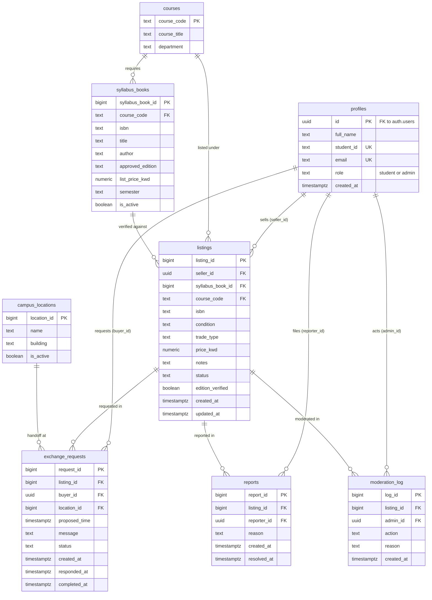

# Schema — Campus Textbook Exchange System

The runnable version is [`schema.sql`](schema.sql). Column names match the acceptance criteria in the story issues. **Owner: Hamad Behbehani (Data Lead).** It changes only through a pull request that the Data Lead and the affected story owners read.
**PK** = primary key · **FK** = foreign key · Row-level security is **on for every table**.

## Row-level security, table by table

| Table | Who can read | Who can write |
|---|---|---|
| `profiles` | Own row; admin reads all. Other students see only `full_name`, through the `profile_names` view | Own row, and only `full_name` and `student_id` (a student cannot change `role`) |
| `courses` | Any logged-in user | Admin only |
| `syllabus_books` | Any logged-in user | Admin only |
| `campus_locations` | Any logged-in user | Admin only |
| `listings` | Catalog (`status = 'available'` and `edition_verified`), own listings, listings I requested, admin | Insert: own listings only. Update: seller of the listing, or admin |
| `exchange_requests` | The buyer, the seller of the book, admin | Insert: buyer, never on own book. Update: buyer, seller, admin |
| `reports` | The reporter, admin | Insert: any student, as themselves. Update: admin |
| `moderation_log` | Admin; a seller sees rows for their own listings | Admin only, as themselves |

Visitors who are not logged in (`anon`) can read and change nothing.

## Rules built into the schema

- A price is required unless `trade_type = 'swap'`.
- `condition`, `trade_type`, `status`, `role` and `action` accept only the listed values.
- ISBN in `syllabus_books` must be 10 or 13 digits.
- One open request per buyer per listing, and one unresolved report per student per listing.
- A `profiles` row is created automatically when someone signs up.

## Rules each story will add when it is built

The schema gives the tables and permissions. The following logic belongs to the stories and is written by whoever holds them:

| Story | Logic to add |
|---|---|
| Sign up with a university email | Refuse emails outside the university domain |
| New listings are checked against the syllabus edition | Trigger that sets `edition_verified` and `syllabus_book_id`, or rejects the listing |
| Listings for a retired textbook are hidden | When `syllabus_books.is_active` becomes false, set `edition_verified = false` on its available listings |
| Seller accepts a request · Buyer cancels a request · Seller confirms the handoff is done | Keep `listings.status` in step with `exchange_requests.status` (a buyer cancelling an accepted request needs a function, because the buyer cannot update the seller's listing directly) |
| Admin removes a listing with a reason | Cancel open requests when a listing is removed |
